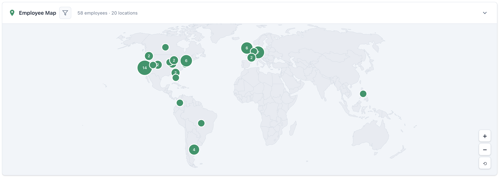

# BambooHR Employee Map

A Chrome extension that adds an interactive world map to BambooHR's employee directory page, showing where your team members are located around the globe.



## Features

- 🗺️ **Interactive World Map** - Zoom, pan, and explore employee locations
- 📍 **Location Pins** - Clustered pins showing employee count per location
- 🔍 **Filters** - Filter by name, job title, department, or division
- 📊 **Real-time Stats** - See employee and location counts update as you filter
- 💾 **Collapsible UI** - Remembers your preference to show/hide the map
- 🔒 **Privacy-focused** - All data stays in your browser, no external services

## Installation

### From Source (Developer Mode)

1. Clone this repository:
   ```bash
   git clone https://github.com/msimulcik/bamboo-employee-map.git
   ```

2. Open Chrome and navigate to `chrome://extensions/`

3. Enable **Developer mode** (toggle in top right)

4. Click **Load unpacked** and select the cloned folder

5. Navigate to your BambooHR directory page (`/employees/directory.php`)

### From Chrome Web Store

*Coming soon*

## Usage

1. Go to your company's BambooHR employee directory page
2. The map will appear at the top of the page
3. Click the **filter icon** to filter employees by name, job title, department, or division
4. Click on a **pin** to see the list of employees at that location
5. Use the **collapse button** to hide/show the map

## How It Works

The extension:
1. Fetches employee data from BambooHR's internal API (same data shown in the directory)
2. Geocodes locations using a bundled database of countries and states (no external API calls)
3. Renders an interactive map using D3.js
4. Groups employees by location and displays them as pins

## Project Structure

```
bamboo-employee-map/
├── manifest.json          # Chrome extension manifest (v3)
├── src/
│   ├── content.js         # Main content script
│   ├── map.js             # D3.js map rendering
│   ├── geocoder.js        # Location-to-coordinates lookup
│   ├── popup.js           # Employee popup component
│   └── styles.css         # All styling
├── data/
│   ├── world-110m.json    # TopoJSON world map
│   └── cities.json        # Countries and states database
├── lib/
│   ├── d3.min.js          # D3.js library
│   └── topojson.min.js    # TopoJSON client
└── icons/                 # Extension icons
```

## Development

### Prerequisites

- Google Chrome browser
- Basic knowledge of Chrome extensions

### Making Changes

1. Edit the source files in `src/`
2. Go to `chrome://extensions/`
3. Click the refresh icon on the extension card
4. Reload the BambooHR directory page

### Adding New Locations

If a location isn't being recognized, you can add it to `data/cities.json`:

```json
{
  "countries": [
    {"name": "Country Name", "code": "XX", "lat": 0.0, "lng": 0.0}
  ],
  "states": {
    "US": [
      {"code": "XX", "name": "State Name", "lat": 0.0, "lng": 0.0}
    ]
  }
}
```

## Privacy

This extension:
- ✅ Only runs on `bamboohr.com` pages
- ✅ Only accesses data you already have permission to view
- ✅ Does not send data to any external servers
- ✅ Does not track usage or analytics
- ✅ All geocoding is done locally using bundled data

## License

MIT License - see [LICENSE](LICENSE) for details.

## Contributing

Contributions are welcome! Please read [CONTRIBUTING.md](CONTRIBUTING.md) for guidelines.

## Acknowledgments

- Map data from [Natural Earth](https://www.naturalearthdata.com/)
- Rendering powered by [D3.js](https://d3js.org/)
- TopoJSON by [Mike Bostock](https://github.com/topojson/topojson)

